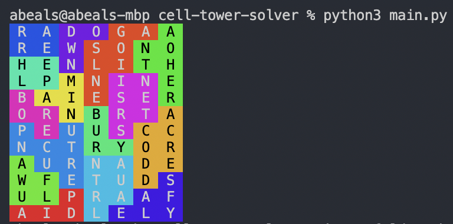

# cell-tower-solver
Exploration of a generator and solver for https://www.andrewt.net/puzzles/cell-tower/

Sample solved grid:

Wordlist downloaded from https://www.andrewt.net/puzzles/cell-tower/assets/words.json as of June 6, 2022.
Alternative wordlists downloaded from https://www.keithv.com/software/wlist/.

Color printing adapted from https://gist.github.com/iansan5653/c4a0b9f5c30d74258c5f132084b78db9.

With a new word list, run `cd dictionaries; python3 helper.py` to recreate the pickle file.

Run tests with `python3 tests.py`

Speedups gotten from profiling with `python3 -m cProfile -s time main.py`

Current speeds:
* 1.005 for #??
* 1.298 for #86
* 0.959 for Custom #1

# Potential Words count sizing
<!-- {1: 10606, 2: 4093, 3: 2247, 4: 1495, 5: 890, 6: 671, 7: 525, 8: 438, 9: 383, 10: 327, 11: 216, 12: 188, 13: 95, 14: 165, 15: 228, 16: 196, 17: 87, 18: 103, 19: 110, 20: 90, 21: 152, 22: 48, 23: 52, 24: 47, 25: 54, 26: 43, 539: 5, 28: 57, 29: 60, 30: 42, 31: 39, 32: 17, 33: 15, 34: 31, 35: 68, 36: 23, 37: 7, 550: 4, 39: 32, 40: 19, 41: 22, 42: 26, 43: 19, 44: 11, 45: 17, 46: 6, 48: 31, 49: 21, 562: 10, 51: 36, 52: 30, 53: 85, 54: 15, 55: 9, 56: 18, 57: 19, 570: 12, 59: 26, 60: 10, 61: 24, 62: 8, 63: 11, 64: 16, 65: 3, 66: 7, 67: 6, 68: 22, 69: 6, 70: 5, 71: 12, 1097: 4, 74: 18, 75: 1, 1100: 8, 77: 8, 78: 25, 79: 18, 81: 12, 83: 5, 84: 6, 85: 6, 86: 17, 87: 8, 88: 24, 612: 4, 91: 4, 92: 20, 93: 6, 94: 8, 95: 22, 1120: 7, 98: 6, 99: 4, 1636: 2, 101: 4, 102: 6, 103: 10, 104: 10, 105: 11, 107: 4, 108: 7, 109: 4, 113: 4, 114: 26, 116: 10, 89: 8, 617: 3, 120: 6, 121: 11, 122: 4, 123: 6, 124: 6, 125: 5, 126: 4, 128: 4, 5249: 11, 130: 13, 132: 5, 133: 6, 134: 11, 135: 10, 138: 17, 142: 3, 147: 8, 149: 5, 152: 8, 196: 3, 2074: 2, 161: 6, 162: 2, 27: 45, 164: 5, 1701: 5, 166: 4, 169: 4, 170: 5, 172: 8, 173: 6, 175: 4, 177: 6, 178: 4, 2137: 2, 185: 3, 186: 4, 187: 9, 189: 4, 190: 10, 191: 4, 193: 15, 708: 7, 197: 4, 545: 4, 200: 6, 202: 2, 716: 4, 1233: 4, 210: 9, 211: 12, 212: 3, 728: 6, 1246: 3, 223: 7, 225: 4, 38: 46, 230: 8, 231: 2, 232: 2, 233: 6, 235: 8, 239: 8, 1576: 10, 1266: 2, 553: 4, 251: 6, 252: 4, 257: 9, 770: 4, 259: 5, 261: 5, 129: 3, 267: 3, 642: 4, 782: 12, 275: 6, 277: 2, 3112: 6, 283: 6, 1823: 4, 291: 5, 292: 4, 293: 3, 298: 5, 769: 4, 302: 5, 1840: 4, 309: 3, 312: 4, 314: 3, 319: 3, 321: 3, 325: 3, 96: 7, 331: 4, 334: 9, 335: 9, 1365: 23, 346: 2, 58: 16, 741: 3, 523: 3, 486: 1, 744: 4, 2418: 5, 1908: 8, 2421: 12, 378: 3, 894: 9, 386: 4, 904: 13, 394: 3, 397: 8, 408: 3, 916: 6, 405: 3, 2456: 12, 837: 4, 417: 8, 422: 4, 423: 1, 425: 4, 427: 4, 242: 8, 157: 6, 287: 6, 270: 4, 435: 3, 436: 3, 73: 6, 3013: 5, 454: 1, 1185: 8, 76: 10, 458: 7, 459: 6, 464: 2, 163: 3, 590: 3, 527: 3, 118: 6, 165: 4, 483: 4, 996: 3, 998: 4, 698: 3, 1039: 4, 664: 2, 613: 4, 2032: 9, 499: 15, 500: 3, 505: 2, 1018: 4, 3071: 8} -->
